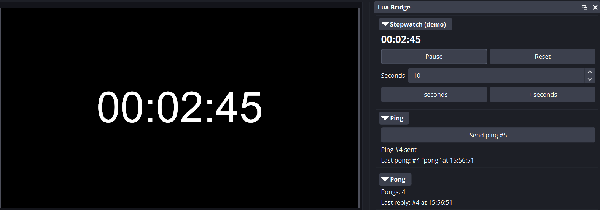

# Lua Bridge for OBS

> **Beta (0.9.0-beta1).** Feedback and bug reports are welcome: [open an issue](https://github.com/midnight-studios/obs-lua-bridge/issues).

Lua Bridge gives your OBS Lua scripts what OBS's own scripting can't do:
- **Controls in a dock:** buttons, labels, number and text inputs, and toggles in **Docks → Lua Bridge**.
- **Commands:** from that dock, from other scripts, or from obs-websocket 5 tools. Confirmed so far: Bitfocus Companion. See [control surfaces](docs/integrations/control-surfaces.md).
- **Live state and custom events** that other scripts and websocket clients can follow.

Scripts written for it keep working when the plugin isn't installed: they simply run without the dock.

*(Screenshot to be added.)*

## Install
Requires **OBS Studio 31.1 or newer**. Download the file for your system from
[Releases](https://github.com/midnight-studios/obs-lua-bridge/releases); full steps and uninstalling are in
[docs/INSTALL.md](docs/INSTALL.md).

**Windows:**
1. Close OBS.
2. Open `obs-lua-bridge-<version>-windows-x64.zip`.
3. Copy the `obs-lua-bridge` folder into `C:\ProgramData\obs-studio\plugins\`.
4. Start OBS.

**macOS (Apple Silicon and Intel).** This beta is **not signed or notarized by Apple**, so macOS asks you to approve it once:
1. Close OBS.
2. Open `obs-lua-bridge-<version>-macos-universal.pkg`. macOS says it can't verify it; click **Done**.
3. Go to **System Settings → Privacy & Security** and click **Open Anyway** next to the message about the package.
4. Run the installer. It installs into your user Library.
5. Start OBS.

The `.tar.xz` is a manual alternative; see [INSTALL.md](docs/INSTALL.md#macos).

**Linux:**
- **Ubuntu 24.04:** `sudo apt install ./obs-lua-bridge-<version>-x86_64-linux-gnu.deb`.
- **Other distributions:** use the `.tar.xz`; see [INSTALL.md](docs/INSTALL.md#linux).

## Quick start (5 minutes)
1. Install the plugin, start OBS, and open **Docks → Lua Bridge**. It says no scripts are registered yet.
2. Open **Tools → Scripts**, click **+**, and pick `hello-bridge.lua` from the plugin's `lua/examples/` folder:
   - **Windows:** `C:\ProgramData\obs-studio\plugins\obs-lua-bridge\data\lua\examples\`
   - **macOS:** `~/Library/Application Support/obs-studio/plugins/obs-lua-bridge.plugin/Contents/Resources/lua/examples/`
     (in the file picker, press **Cmd+Shift+G** and paste the path)
   - **Linux (.deb):** `/usr/share/obs/obs-plugins/obs-lua-bridge/lua/examples/`
3. A **Hello Bridge** section appears in the dock. Click **Ping**: "Last ping" shows the time, and the Script Log
   (Tools → Scripts → Script Log) says `ping received`.
4. **Your own script:**
   1. copy `luabridge.lua`, from the same `lua/` folder, next to your script;
   2. load it with `local bridge = dofile(script_path() .. "luabridge.lua")`;
   3. register your controls. `hello-bridge.lua` is a 50-line template to start from.

## Examples
They ship with the plugin in `lua/examples/`, and are also available on their own as `obs-lua-bridge-lua-<version>.zip`:
- **hello-bridge**: the smallest example, a Ping button and a label.
- **scoreboard**: a score board with +/- buttons that also sends a `score.changed` event.
- **stopwatch-demo**: a stopwatch controlled from the dock, shown in a text source.
- **ping-pong**: two scripts talking to each other, with commands one way and events back.

## Using a Stream Deck
Use [Bitfocus Companion](https://bitfocus.io/companion). It drives Stream Deck hardware directly, and its OBS
module can send Lua Bridge commands ("Custom – Send Vendor Request").
- **Quit Elgato's Stream Deck app first.** Companion's guide recommends connecting Stream Decks without the
  Elgato software ([source](https://companion.free/user-guide/v4.2/surfaces/elgato-streamdeck/)).
- **Setup:** [control surfaces](docs/integrations/control-surfaces.md#using-a-stream-deck).

## Learn more
- [docs/API.md](docs/API.md): the script API, dock controls, the helper library and the obs-websocket requests.
- [docs/INSTALL.md](docs/INSTALL.md): install and uninstall on every platform.
- [lua/README.txt](lua/README.txt): the helper and the examples.
- [docs/integrations/control-surfaces.md](docs/integrations/control-surfaces.md): sending commands from control surfaces. Companion is confirmed; others are being checked.
- [CHANGELOG.md](CHANGELOG.md): what's new. [CONTRIBUTING.md](CONTRIBUTING.md): building and testing.

## License
- **The plugin:** [GPL-2.0-or-later](LICENSE).
- **The Lua helper and examples in [lua/](lua/):** [MIT](lua/LICENSE), so you can copy `luabridge.lua` into scripts under any license.
- **Third-party notices:** [THIRD-PARTY-NOTICES.md](THIRD-PARTY-NOTICES.md).
- **Security:** see [SECURITY.md](SECURITY.md).
